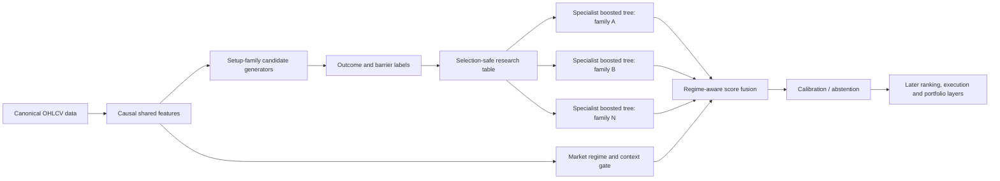

# Regime-Aware Boosted Tree Ensemble

A modular financial-machine-learning research system that separates **candidate discovery**, **specialist prediction**, **market-regime gating**, **cross-sectional context**, **outcome labelling**, and **walk-forward validation** into explicit, testable contracts.

> **Status:** public research release reconstructed from a larger private Trading Systems Research archive. The public repository preserves the causal infrastructure, data contracts, **61 passing public tests**, and a generic specialist boosted-tree reference layer. Exact proprietary setup thresholds, private datasets, generated candidate shards, trained models, and production trading logic are intentionally excluded.

## Why this project exists

Most market models collapse everything into one table and one universal predictor. This project takes a different approach:

- each setup family can have its own specialist model;
- a separate regime gate controls when each specialist should be trusted;
- cross-sectional and market context remain distinct from stock-specific signals;
- all features are frozen at the signal close;
- entry cannot occur before the next valid session open;
- candidate records never contain future outcomes;
- downstream models consume only purged, out-of-fold information;
- generated artifacts are fingerprinted and reproducible.

The architecture is designed as a rigorous tree-based foundation for the related neural project, [Regime-Aware Multiscale Neural Architecture](https://github.com/ImrichV/Regime-Aware-Multiscale-Neural-Architecture).

## Architecture



## What is implemented here

### Recovered and hardened pipeline

- canonical Stooq ZIP parser and instrument identity;
- strict OHLCV validation and quarantine;
- a 36-feature causal shared feature engine;
- deterministic feature, candidate, outcome, and research stores;
- stable candidate IDs and timestamp lineage;
- next-open entry alignment;
- multi-horizon return, MFE, MAE, and barrier labels;
- deterministic ticker partitions and temporal partitions;
- purged expanding-window baseline evaluation;
- repository doctor, resumable runs, manifests, fingerprints, and atomic writes.

### Public reference ensemble

`tsr.ensemble.RegimeAwareBoostedTreeEnsemble` implements:

- one histogram gradient-boosted regressor per setup family;
- one histogram gradient-boosted classifier per setup family;
- a separate boosted-tree regime/context gate;
- gated specialist probabilities and expected-return scores;
- explicit refusal to score unseen or unfitted families.

This reference layer demonstrates the intended architecture. It is not represented as the accepted production model, and it deliberately performs no hyperparameter search, threshold selection, trade sizing, or portfolio optimization.

## Evidence from the recovered research archive

The complete private continuation archive reconstructed from eight TSR chunks contained:

- **151 passing automated tests**;
- **11 frozen causal candidate families**;
- **561,793 candidate IDs** in the accepted outcome catalogue;
- **132 fixed walk-forward Ridge/logistic baseline models** across families and folds;
- source coverage across approximately **20.5 million daily bars**;
- deterministic artifacts and prefix-causality audits;
- explicit survivor-panel and contamination warnings.

These numbers document engineering and validation work. They are **not profitability claims**.

## Public setup-family catalogue

The private archive contains frozen candidate generators for broad families including trend pullbacks, consolidations, volatility contractions, oversold recoveries, failed moves, relative-weakness breakdowns, relief-rally failures, orderly continuations, and capitulation/reclaim structures. Their high-level roles are documented in [`docs/FAMILY_CATALOG.md`](docs/FAMILY_CATALOG.md); exact thresholds and full generator code are not public.

A deliberately non-production example is provided at:

```text
src/tsr/playbooks/public_demo.py
```

## Installation

```bash
python -m venv .venv
source .venv/bin/activate        # Linux/macOS
# .venv\Scripts\Activate.ps1   # Windows PowerShell

python -m pip install --upgrade pip
python -m pip install -e . --no-build-isolation
python -m pip install pytest
```

## Verify the repository

```bash
pytest -q
python -m compileall -q src
rabte doctor --project-root .
```

## Run the synthetic ensemble example

```bash
python examples/synthetic_specialist_ensemble.py
```

The example creates synthetic setup families and demonstrates specialist fitting plus regime-aware score fusion. It does not use real market data or claim trading performance.

## CLI

```text
rabte data ...        canonical data audit and publication
rabte features ...    causal feature build and verification
rabte candidates ...  candidate framework build and verification
rabte outcomes ...    separate future-outcome and barrier labels
rabte research ...    selection-safe research tables and baselines
rabte doctor ...      repository, dependency and configuration checks
```

The historical alias `tsr` remains available.

## Reproducibility principles

- immutable source and configuration fingerprints;
- deterministic IDs and shard paths;
- atomic writes and resumable run manifests;
- no silent scientific repair after failure;
- prefix-causality tests for candidate generators;
- purged walk-forward predictions;
- protected ticker and temporal partitions;
- failed experiments retained rather than overwritten;
- explicit distinction between infrastructure acceptance and trading validity.

## Critical limitations

The original Stooq archive is heavily survivor-dominated. Results derived from it cannot be described as unbiased historical investable performance. The public repository contains no point-in-time fundamentals, delisted-symbol reconstruction, borrow availability, realistic intraday fill model, or accepted portfolio simulator.

See [`KNOWN_LIMITATIONS.md`](KNOWN_LIMITATIONS.md) and [`VALIDATION_POLICY.md`](VALIDATION_POLICY.md).

## Public-scope policy

Included:

- reusable research infrastructure;
- causal schemas and storage contracts;
- synthetic tests and examples;
- public demonstration models;
- high-level architecture and validation documentation.

Excluded:

- raw or licensed datasets;
- exact private setup thresholds;
- generated candidate/outcome/research shards;
- ticker-level predictions and trade lists;
- trained production weights;
- API keys, credentials, and cloud configuration;
- proprietary execution, sizing, and portfolio logic.

## Disclaimer

This repository is for research and software-engineering demonstration only. It does not provide investment advice, a trading recommendation, or evidence that any published or private model is suitable for live capital.
